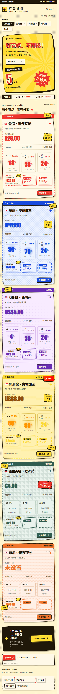

# monitor-theme-guangao

为 [Monitor](https://github.com/monitor-probe/monitor) 打造的「牛皮癣广告墙」公开状态页主题：促销横幅、手绘纸边、探照光影和流量票券，展示真实探针数据。

[](LICENSE)
[](https://github.com/ayingQAQ/monitor-theme-guangao/releases/latest)

## 截图

以下截图全部来自明确标记的开发演示数据，不包含真实服务器信息。桌面三列卡片保持等比例缩放，手机使用单列布局。

### 红黄促销墙


### 紫绿广告墙


### 复古 GIF 广告墙


### 手机预览



## 功能

- 三种广告墙皮肤、手绘选择菜单、动效与边框灯开关。
- CPU、内存、硬盘、本月剩余流量、上传与下载速度。
- 分组筛选与对应汇总，费用、账期、到期和离线状态。
- 节点详情、资源历史与延迟曲线，查询范围跟随 Hub 保留天数。
- 文本与 gzip WebSocket 快照、断线恢复及页面后台暂停。
- 站长在 Monitor 后台保存主题设置；访客偏好仅保存在当前浏览器。
- 遵循系统减少动态效果设置；生产包不包含演示接口或演示节点数据。

## 安装

在 Monitor 后台的主题页选择「从 GitHub 安装」，填写：

```text
https://github.com/ayingQAQ/monitor-theme-guangao
```

也可以从 [最新正式 Release](https://github.com/ayingQAQ/monitor-theme-guangao/releases/latest) 下载 `theme.tar.gz`，在后台上传并选择「广告墙 · Guangao」。请下载主题包，而不是 GitHub 自动生成的 Source code 压缩包。

主题短名为 `monitor-theme-guangao`，安装包解压结构：

```text
monitor-theme-guangao/
├── theme.json
├── preview.png
├── LICENSE
├── THIRD_PARTY.md
├── THIRD_PARTY_NOTICES.txt
└── dist/
    └── index.html
```

后台主题设置支持皮肤、横幅标题、纯文本公告、汇总、浮窗和动效。后台及登录页由 Hub 提供。

从旧短名 `guangao-theme` 升级时，新主题会作为独立条目安装，需要重新选择并保存站点主题设置。

## 本地开发

需要 Node.js 24.11+。

```sh
npm ci
npm run dev:demo
```

打开 `http://127.0.0.1:5173`。页面会标明「演示数据 · 非真实节点」。

使用真实公开 Hub 时，设置 `MONITOR_HUB` 后运行 `npm run dev`：

```sh
# Linux / macOS
MONITOR_HUB=https://your-monitor.example.com npm run dev
```

```powershell
# PowerShell
$env:MONITOR_HUB = 'https://your-monitor.example.com'
npm run dev
```

开发服务器只监听本机，代理同源 `/api` 请求和 WebSocket；没有设置变量时，默认连接 `http://127.0.0.1:9911`。

## 验证与打包

```sh
npm test
npm run lint
npm run build
npx playwright install chromium
npm run test:e2e
npm run package
```

`npm run package` 生成 `theme.tar.gz`，校验清单、目录名、文件类型、体积限制和 gzip 完整性。发布时使用与 `theme.json.version` 对应的正式 tag，Release 附件名保持 `theme.tar.gz`。

截图更新：先运行演示服务器，再执行 `node scripts/capture.mjs`。脚本仅接受标记为演示数据的页面。

[接口检查记录](docs/protocol-audit.md) 列出了测试范围与实测限制。`node scripts/audit-hub.mjs` 可对 `MONITOR_HUB` 指定的公开 Hub 做只读协议检查。

反向代理或 WAF 应放行 `/`、`/node/{id}`、`/favicon.svg` 和 `/apple-touch-icon.png`，以及 Monitor 自身的 API 和后台路径。

## 开发依据与许可

遵循 [主题开发指南](https://monitor-document.pages.dev/dev/theme) 和 [架构与协议](https://monitor-document.pages.dev/dev/architecture)。

本项目采用 [MIT License](LICENSE)。数据接口、格式化、历史图表和部分共享组件参考 [monitor-theme-default](https://github.com/monitor-probe/monitor-theme-default)，保留原作者版权声明。来源版本见 [THIRD_PARTY.md](THIRD_PARTY.md)，依赖许可见 [THIRD_PARTY_NOTICES.txt](THIRD_PARTY_NOTICES.txt)。手绘视觉参考 [PaperCSS](https://github.com/papercss/papercss) 与 [Wired Elements](https://github.com/rough-stuff/wired-elements) 的设计理念，未引入它们的组件代码。

请勿提交真实节点数据、密码、令牌、私钥、数据库或本地环境文件。生产构建与演示数据保持隔离。
