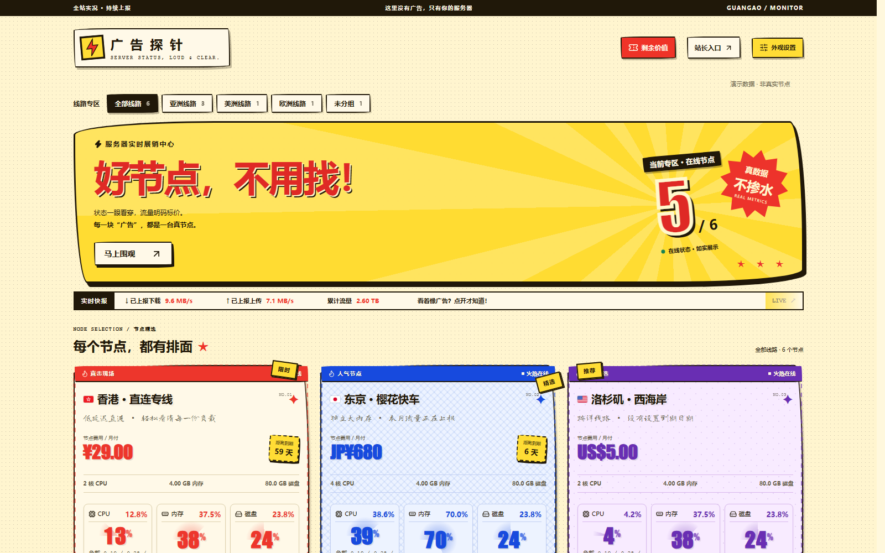
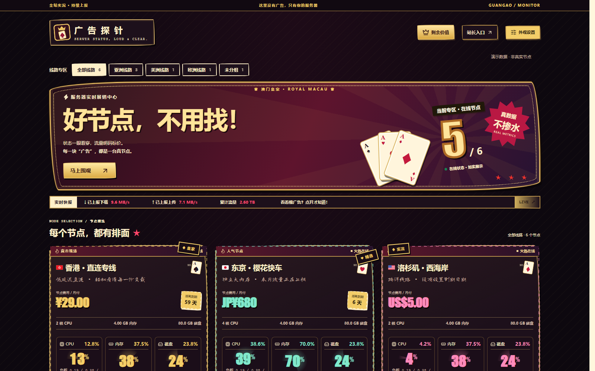
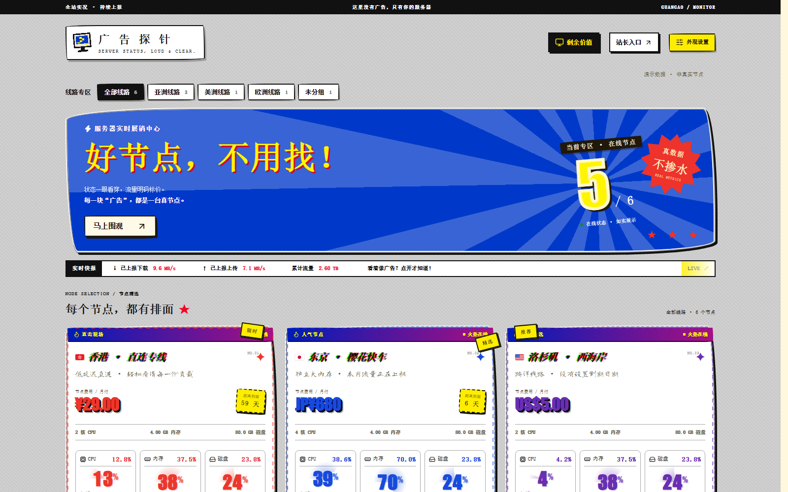

# monitor-theme-guangao

为 [Monitor](https://github.com/monitor-probe/monitor) 打造的「牛皮癣广告墙」公开状态页主题：促销横幅、手绘纸边、探照光影和流量票券，展示真实探针数据。

[](LICENSE)
[](https://github.com/ayingQAQ/monitor-theme-guangao/releases/latest)

## 截图

以下截图全部来自明确标记的开发演示数据，不包含真实服务器信息。三种皮肤统一采用 1600 × 1000（16:10）桌面截图，桌面三列卡片保持等比例缩放。

### 红黄促销墙



### 澳门皇家赌场风



### 复古 GIF 广告墙



## 功能

- 右上角外观设置：三种广告墙皮肤、手绘选择菜单、动效与边框灯开关。
- 剩余价值计算器：节点预填、货币与汇率、可调整付款周期、剩余价值及售价溢价，支持 PNG 与 Markdown 导出。红黄手写账本、皇家绒面筹码台、复古桌面程序分别采用独立布局与字体。
- 外币参考汇率来自 [Frankfurter](https://frankfurter.dev/)，可手动修改；人民币无需请求汇率。表单与导出均在本地处理。
- 离线节点专属「暂停营业」告示牌，保留离线时长、剩余流量与历史档案入口。
- 三种皮肤各有默认站点图标；后台上传的自定义图标优先显示。
- 免费节点专属 FREE 礼物价格标志和期限贴纸，区分到期、过期与未设到期日期。
- CPU、内存、硬盘、本月剩余流量、上传与下载速度。
- 分组筛选与对应汇总，费用、账期、到期和离线状态。
- 节点详情、资源历史与延迟曲线，查询范围跟随 Hub 保留天数。
- 文本与 gzip WebSocket 快照、断线恢复及页面后台暂停。
- 站长在 Monitor 后台保存主题设置；访客偏好仅保存在当前浏览器。
- 遵循系统减少动态效果设置；生产包不包含演示接口或演示节点数据。

## 安装

在 Monitor 后台的主题页选择「从 GitHub 安装」，填写：

```text
https://github.com/ayingQAQ/monitor-theme-guangao
```

也可以从 [最新正式 Release](https://github.com/ayingQAQ/monitor-theme-guangao/releases/latest) 下载 `theme.tar.gz`，在后台上传并选择「广告墙 · Guangao」。请下载主题包，而不是 GitHub 自动生成的 Source code 压缩包。

需要让后台也使用对应图标时，可下载 PNG 后在「站点图标」中上传：[红黄闪电](public/icons/site-promo.png)、[皇家扑克](public/icons/site-royal.png)、[复古显示器](public/icons/site-retro.png)。

## 开发依据与许可

遵循 [主题开发指南](https://monitor-document.pages.dev/dev/theme) 和 [架构与协议](https://monitor-document.pages.dev/dev/architecture)。

本项目采用 [MIT License](LICENSE)。数据接口、格式化、历史图表和部分共享组件参考 [monitor-theme-default](https://github.com/monitor-probe/monitor-theme-default)，保留原作者版权声明。来源版本见 [THIRD_PARTY.md](THIRD_PARTY.md)，依赖许可见 [THIRD_PARTY_NOTICES.txt](THIRD_PARTY_NOTICES.txt)。手绘视觉参考 [PaperCSS](https://github.com/papercss/papercss) 与 [Wired Elements](https://github.com/rough-stuff/wired-elements) 的设计理念，未引入它们的组件代码。

请勿提交真实节点数据、密码、令牌、私钥、数据库或本地环境文件。生产构建与演示数据保持隔离。
